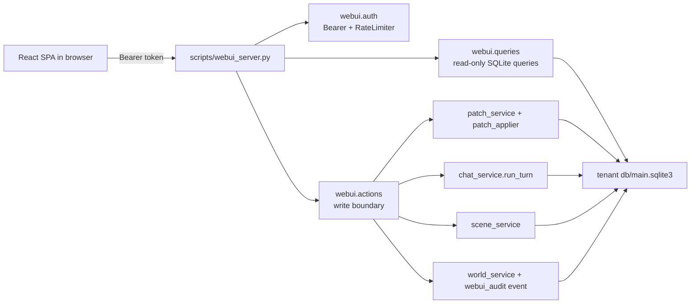

# Phase 73 Spec: Host-local React WebUI Workbench

日期：2026-04-26

状态：Implementing

## 目标

Phase 73 把 `we-together` 从 CLI / MCP / Codex skill 可用，推进到宿主机浏览器可操作：

- 看清当前社会图谱、scene 激活、shared memory、branch 风险与 world 对象。
- 在受控字段白名单内编辑核心 entity。
- 所有核心图谱写入继续走 `event -> patch -> apply` 审计链。
- 局域网访问必须显式 Bearer token；静态 SPA 可加载，数据 API 不可匿名访问。

## 非目标

- 不做公网 SaaS。
- 不引入 FastAPI / Flask 等后端依赖。
- 不允许前端发送任意 SQL。
- 不在第一版重构 world patch model；world 写入复用 `world_service` 并补 `webui_audit` event。
- 不把 operator-gated branch resolve 自动化。

## 架构



## 后端模块

- `src/we_together/webui/auth.py`
- `src/we_together/webui/queries.py`
- `src/we_together/webui/actions.py`
- `src/we_together/webui/server.py`
- `scripts/webui_server.py`

## 启动

```bash
WE_TOGETHER_WEBUI_TOKEN=dev-token \
  .venv/bin/python scripts/webui_server.py \
    --root . \
    --tenant-id default \
    --host 0.0.0.0 \
    --port 7788
```

规则：

- `--token` 优先，其次 `WE_TOGETHER_WEBUI_TOKEN`。
- `--host 0.0.0.0`、局域网 IP 或任何非 loopback host 时，没有 token 必须启动失败。
- `/healthz` 与 `/metrics` 可匿名访问，用于宿主机健康检查。
- `/api/*` 必须有 `Authorization: Bearer <token>`。
- 默认 rate limit 为每 token 每分钟 120 次。

## API v1

读接口：

- `GET /healthz`
- `GET /api/bootstrap`
- `GET /api/summary`
- `GET /api/scenes`
- `GET /api/graph?scene_id=&include=`
- `GET /api/entities/{type}/{id}`
- `GET /api/events?limit=&entity_type=&entity_id=`
- `GET /api/patches?status=&operation=&target_type=&target_id=`
- `GET /api/snapshots?limit=`
- `GET /api/retrieval-package?scene_id=`
- `GET /api/world?scene_id=`
- `GET /api/world/objects`
- `GET /api/world/places`
- `GET /api/world/projects`
- `GET /api/branches?status=open`
- `GET /api/metrics`
- `GET /metrics`

写接口：

- `POST /api/chat/run-turn`
- `POST /api/scenes`
- `POST /api/scenes/{scene_id}/participants`
- `PATCH /api/scenes/{scene_id}`
- `PATCH /api/entities/{type}/{id}`
- `POST /api/entities/{type}/{id}/archive`
- `POST /api/entities/link`
- `POST /api/entities/unlink`
- `POST /api/memories`
- `POST /api/branches/{branch_id}/resolve`
- `POST /api/world/objects`
- `POST /api/world/places`
- `POST /api/world/projects`
- `PATCH /api/world/projects/{project_id}/status`

统一 JSON 格式：

```json
{"ok": true, "data": {}}
```

```json
{"ok": false, "error": {"code": "unauthorized", "message": "Invalid bearer token."}}
```

## 写入语义

核心 entity：

- `person`: `primary_name`, `persona`/`persona_summary`, `status`, `metadata_json`
- `relation`: `core_type`, `summary`, `strength`, `status`
- `memory`: `summary`, `relevance_score`, `status`
- `group`: `name`, `summary`, `status`, `metadata_json`

所有 entity 更新流程：

1. 写入 `events.event_type='webui_audit'`。
2. `build_patch(operation='update_entity')`。
3. `apply_patch_record(...)`。
4. 返回 `event_id`, `patch_id`, `summary`。

Branch resolve：

1. 写入 `webui_audit` event。
2. 构造 `resolve_local_branch` patch。
3. `apply_patch_record(...)` 校验 candidate 属于 branch。
4. operator-gated branch 仍必须由用户显式选择 candidate。

World 写入：

1. 调用 `register_object` / `register_place` / `register_project` / `set_project_status`。
2. 写入 `webui_audit` event。
3. 返回 `audit_event_id` 与最新 summary。

## 前端产品面

首屏为 Graph Workspace：

- 左侧导航：图谱、对话、世界、复核、指标。
- 中心：React Flow 图谱画布。
- 右侧：详情检查器与编辑抽屉。
- 底部：events / patches / snapshots 时间线。

交互原则：

- Token gate 优先出现，token 存在 `sessionStorage`。
- API client 自动附带 Bearer token。
- 401 / 429 / bad_request 统一显示在 workspace 顶部。
- 节点点击打开详情。
- 编辑模式先显示 `Diff Preview`，再提交 Patch。
- 写入成功显示 `event_id` / `patch_id` / `audit_event_id`。

## 验收矩阵

| Area | 必须通过 |
|---|---|
| Auth | 无 token / 错 token 401；正确 token 200；LAN 无 token 拒绝启动 |
| Graph | `/api/graph` 返回 person / memory / group nodes 与 relation / memory edges |
| Entity | person / relation / memory / group detail 可读 |
| Editor | person 更新生成 `webui_audit` event + `update_entity` patch |
| Links | link/unlink 生成 `entity_link` patch |
| Chat | `chat_service.run_turn` 返回 text / event_id / snapshot_id |
| World | active world 可读，object/place/project 可创建并写 audit event |
| Review | branch candidates 可读，resolve 走 `resolve_local_branch` patch |
| Frontend | token gate、graph render、detail drawer、diff preview、PATCH Bearer |
| Smoke | seed -> start server -> curl health/summary/graph |

## 风险

- React Flow 在极大图谱上需要后续虚拟化或 query paging。
- `world_service` 第一版仍是 service-direct 写入，不是 patch-only；已用 `webui_audit` event 弥补可追踪性。
- API 当前是 stdlib `HTTPServer`，适合 host-local，不适合公网高并发。
- 静态 SPA 构建产物不提交仓库；运行完整 UI 前需要 `cd webui && npm install && npm run build`。
